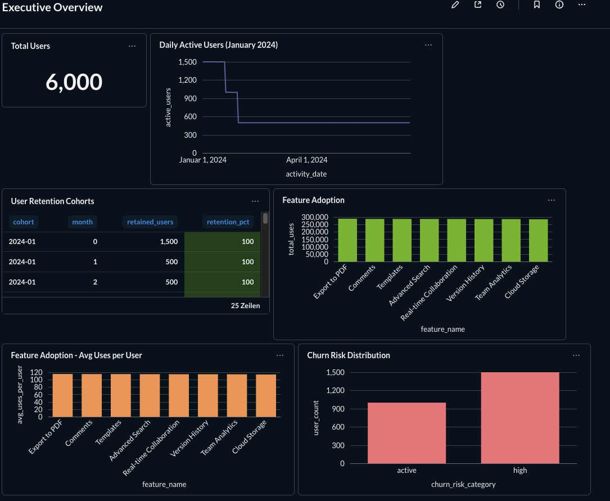

# SaaS Analytics Pipeline

[](https://github.com/vlabogac-png/saas-analytics-pipeline/actions/workflows/ci.yml)
[](https://github.com/vlabogac-png/saas-analytics-pipeline/actions/workflows/codeql.yml)
[](https://opensource.org/licenses/MIT)

A production-grade data engineering project that processes **11.4 million** synthetic SaaS events through a 4-layer ETL architecture using Apache Airflow, PostgreSQL, and Metabase.



##  Project Overview

This project demonstrates end-to-end data engineering skills by building a complete analytics pipeline for a fictional SaaS product. The pipeline processes user events, transforms them through multiple layers, and provides actionable insights through interactive dashboards.

**Key Highlights:**
-  **11.4M events** processed (Jan 2024 - Jan 2026)
-  **4-layer architecture**: Raw → Staging → Core → Analytics
-  **Automated orchestration** with Apache Airflow
-  **Interactive dashboards** in Metabase
-  **Fully containerized** with Docker Compose

---

##  Live Dashboard

The **Executive Overview** dashboard provides real-time insights:

- **Total Users**: 6,000 registered users
- **Daily Active Users**: Trend analysis showing engagement patterns
- **User Retention Cohorts**: 100% retention for 2024-01 cohort over 3 months
- **Feature Adoption**: Export to PDF leads with 300k+ uses
- **Churn Risk Distribution**: 40% active users, 60% high-risk

**Access:** http://localhost:3000 (after running `docker-compose up`)

---

##  Architecture

### Data Flow
```
Synthetic Event Generator (Python)
    ↓
Raw Layer (JSONB storage in PostgreSQL)
    ↓
Staging Layer (Parsed & validated events)
    ↓
Core Layer (Star Schema: 4 dimensions + 2 facts)
    ↓
Analytics Layer (3 materialized views)
    ↓
Metabase Dashboard (BI visualization)
```

### Technology Stack

| Component | Technology |
|-----------|------------|
| **Orchestration** | Apache Airflow 2.8 |
| **Data Warehouse** | PostgreSQL 15 |
| **BI Tool** | Metabase |
| **Language** | Python 3.11, SQL |
| **Infrastructure** | Docker Compose |
| **Version Control** | Git/GitHub |

---

##  Database Schema

### Core Layer (Star Schema)

**Dimensions:**
- `dim_users` (2,500 users) - User profiles with SCD Type 2
- `dim_documents` (4,000 docs) - Document metadata
- `dim_features` (8 features) - Product features
- `dim_date` (2,555 days) - Date dimension (2020-2026)

**Facts:**
- `fact_events` (11.4M rows) - Granular event-level data
- `fact_daily_user_activity` (673k rows) - Daily aggregations

### Analytics Layer (Materialized Views)

1. **user_retention_cohorts** - Monthly cohort retention analysis
2. **feature_adoption_funnel** - Feature usage metrics and engagement
3. **churn_risk_scores** - User churn risk classification (active/low/medium/high)

---

## 🚀 Quick Start

### Prerequisites
- Docker Desktop (4GB+ RAM recommended)
- Available ports: 5432, 8080, 3000, 5050

### Installation

```bash
# 1. Clone the repository
git clone https://github.com/vlabogac-png/saas-analytics-pipeline.git
cd saas-analytics-pipeline

# 2. Set up environment variables
cp env.example .env
echo "AIRFLOW_UID=$(id -u)" >> .env

# 3. Start all services
docker-compose up -d

# 4. Wait for initialization (~2 minutes)
docker-compose logs -f airflow-init

# 5. Initialize database schemas (REQUIRED on first run)
docker exec -i saas_postgres psql -U dataeng -d saas_analytics < sql/ddl/01_raw_layer.sql
docker exec -i saas_postgres psql -U dataeng -d saas_analytics < sql/ddl/02_staging_layer.sql
docker exec -i saas_postgres psql -U dataeng -d saas_analytics < sql/ddl/03_core_layer.sql
docker exec -i saas_postgres psql -U dataeng -d saas_analytics < sql/ddl/04_analytics_layer.sql

# 6. Configure Airflow database connection (REQUIRED for DAG execution)
docker exec saas_airflow_webserver airflow connections add 'postgres_saas' \
    --conn-type 'postgres' \
    --conn-host 'postgres' \
    --conn-schema 'saas_analytics' \
    --conn-login 'dataeng' \
    --conn-password 'secure_password_123' \
    --conn-port '5432'

# 7. Access the UIs
# Airflow: http://localhost:8080 (admin/admin)
# Metabase: http://localhost:3000
# pgAdmin: http://localhost:5050
```

### Generate Sample Data

**Note:** Database schemas must be initialized (step 5 above) before generating data.

```bash
# Create virtual environment
python3 -m venv venv
source venv/bin/activate  # On Windows: venv\Scripts\activate

# Install dependencies
pip install -r requirements.txt

# Generate events (Jan 2024 - Jan 2026)
python generate_current_events.py
```

### Run the ETL Pipeline

```bash
# Trigger the Airflow DAG
docker exec saas_airflow_webserver airflow dags trigger saas_analytics_pipeline

# Monitor progress in Airflow UI
open http://localhost:8080
```

---

## 📁 Project Structure

```
saas-analytics-pipeline/
├── airflow/                    # Airflow home directory
│   ├── dags/                   # Auto-synced from /dags
│   └── logs/                   # Execution logs
├── dags/
│   └── saas_analytics_dag.py   # Main ETL pipeline DAG
├── sql/
│   ├── ddl/                    # Schema definitions
│   │   ├── 01_raw_layer.sql
│   │   ├── 02_staging_layer.sql
│   │   ├── 03_core_layer.sql
│   │   └── 04_analytics_layer.sql
│   └── transformations/
│       ├── raw_to_staging.sql
│       ├── staging_to_core.sql
│       └── refresh_analytics.sql
├── src/
│   ├── ingestion/
│   │   └── event_generator.py  # Synthetic event generator
│   └── utils/
├── generate_realistic_events.py   # Historical data generator
├── generate_current_events.py     # Current data generator
├── docker-compose.yml
├── requirements.txt
├── env.example
├── dashboard_screenshot.png
└── README.md
```

---

##  ETL Pipeline Details

### Airflow DAG: `saas_analytics_pipeline`

**Schedule:** Daily @ 2:00 UTC  
**Execution Time:** ~5-10 minutes

**Task Flow:**
```
raw_to_staging
    ├─> load_dim_users
    ├─> load_dim_documents
    ├─> load_dim_features
    └─> load_dim_date
            └─> load_fact_events
                    └─> load_fact_daily_user_activity
                            ├─> refresh_user_retention
                            ├─> refresh_feature_adoption
                            └─> refresh_churn_risk
```

### Layer Descriptions

**1. Raw Layer**
- Immutable JSONB storage
- Batch tracking and audit trail
- No transformations applied

**2. Staging Layer**
- Parsed and typed columns
- Data validation and deduplication
- Temporary storage for processing

**3. Core Layer**
- Star schema design
- Slowly Changing Dimensions (SCD Type 2)
- Optimized for analytical queries

**4. Analytics Layer**
- Pre-aggregated metrics
- Materialized views for performance
- Business-ready KPIs

---

##  Sample Analytics Queries

### Feature Adoption Analysis
```sql
SELECT 
    feature_name,
    total_uses,
    unique_users,
    ROUND(total_uses::numeric / unique_users, 1) as avg_uses_per_user
FROM analytics.feature_adoption_funnel
ORDER BY total_uses DESC;
```

### Churn Risk Distribution
```sql
SELECT 
    churn_risk_category,
    COUNT(*) AS user_count,
    ROUND(100.0 * COUNT(*) / SUM(COUNT(*)) OVER (), 1) as percentage
FROM analytics.churn_risk_scores
GROUP BY churn_risk_category
ORDER BY churn_risk_category;
```

### Daily Active Users Trend
```sql
SELECT 
    activity_date,
    COUNT(DISTINCT user_sk) as daily_active_users,
    SUM(total_events) as total_events
FROM core.fact_daily_user_activity
WHERE activity_date >= CURRENT_DATE - INTERVAL '30 days'
GROUP BY activity_date
ORDER BY activity_date;
```

---

## 🛠️ Manual Operations

### Run Transformations Manually

```bash
# Raw → Staging
docker exec -i saas_postgres psql -U dataeng -d saas_analytics < sql/transformations/raw_to_staging.sql

# Staging → Core
docker exec -i saas_postgres psql -U dataeng -d saas_analytics < sql/transformations/staging_to_core.sql

# Refresh Analytics
docker exec -i saas_postgres psql -U dataeng -d saas_analytics < sql/transformations/refresh_analytics.sql
```

### Database Access

```bash
# PostgreSQL CLI
docker exec -it saas_postgres psql -U dataeng -d saas_analytics

# Check data volumes
SELECT 'Raw' as layer, COUNT(*) FROM raw.events
UNION ALL
SELECT 'Staging', COUNT(*) FROM staging.events
UNION ALL
SELECT 'Core', COUNT(*) FROM core.fact_events;
```

---

##  Data Quality & Validation

### Event Processing Validation
```sql
WITH layer_counts AS (
    SELECT 'Raw' as layer, COUNT(*) as cnt FROM raw.events
    UNION ALL
    SELECT 'Staging', COUNT(*) FROM staging.events
    UNION ALL
    SELECT 'Core', COUNT(*) FROM core.fact_events
)
SELECT 
    layer,
    cnt as record_count,
    ROUND(100.0 * cnt / FIRST_VALUE(cnt) OVER (ORDER BY layer), 2) as pct_of_raw
FROM layer_counts;
```

### Duplicate Detection
```sql
SELECT event_id, COUNT(*) 
FROM staging.events 
GROUP BY event_id 
HAVING COUNT(*) > 1;
```

---

##  CI/CD Pipeline

This project includes automated CI/CD workflows using GitHub Actions:

### Continuous Integration (CI)

**Workflow:** `.github/workflows/ci.yml`

Runs on every push and pull request to `main` and `develop`:

-  **Python Linting** - Black code formatting & Flake8 linting
-  **SQL Validation** - Syntax checking for DDL and transformation files
-  **Docker Build** - Validates docker-compose configuration
-  **Python Tests** - Runs pytest with coverage reporting
-  **Documentation Check** - Validates README completeness
-  **Security Scan** - Trivy vulnerability scanner

### Continuous Deployment (CD)

**Workflow:** `.github/workflows/cd.yml`

Triggers on version tags (e.g., `v1.0.0`):

-  **GitHub Releases** - Automatic release creation with changelog
-  **Documentation Deployment** - Updates project documentation

### Code Security

**Workflow:** `.github/workflows/codeql.yml`

Runs weekly and on PRs:

-  **CodeQL Analysis** - Security and code quality scanning
-  **Dependency Scanning** - Checks for vulnerable dependencies

### Running CI Locally

```bash
# Install development dependencies
pip install black flake8 pytest pytest-cov

# Run linting
black --check .
flake8 .

# Run tests
pytest tests/ -v --cov=src

# Validate docker-compose
docker compose config
```

## Learning Outcomes

This project demonstrates:

**Data Engineering Fundamentals**
- ETL/ELT pipeline design
- Dimensional modeling (Star Schema)
- Data quality and validation
- Incremental vs. full refresh strategies

**Technical Skills**
- Apache Airflow orchestration
- PostgreSQL optimization
- Docker containerization
- SQL performance tuning
- Python data generation

**Best Practices**
- Version control with Git
- Comprehensive documentation
- Modular code structure
- Environment configuration management

---

## Troubleshooting

### Starting from Scratch (Reset Everything)

If you need to completely reset the project and start over:

```bash
# 1. Stop and remove all containers and volumes
docker-compose down -v

# 2. Start services again
docker-compose up -d

# 3. Wait for initialization (~2 minutes)
docker-compose logs -f airflow-init

# 4. Initialize database schemas (in order!)
docker exec -i saas_postgres psql -U dataeng -d saas_analytics < sql/ddl/01_raw_layer.sql
docker exec -i saas_postgres psql -U dataeng -d saas_analytics < sql/ddl/02_staging_layer.sql
docker exec -i saas_postgres psql -U dataeng -d saas_analytics < sql/ddl/03_core_layer.sql
docker exec -i saas_postgres psql -U dataeng -d saas_analytics < sql/ddl/04_analytics_layer.sql

# 5. Configure Airflow connection
docker exec saas_airflow_webserver airflow connections add 'postgres_saas' \
    --conn-type 'postgres' \
    --conn-host 'postgres' \
    --conn-schema 'saas_analytics' \
    --conn-login 'dataeng' \
    --conn-password 'secure_password_123' \
    --conn-port '5432'

# 6. Generate events
python generate_current_events.py

# 7. Run ETL transformations (or use Airflow DAG)
docker exec -i saas_postgres psql -U dataeng -d saas_analytics < sql/transformations/raw_to_staging.sql
docker exec -i saas_postgres psql -U dataeng -d saas_analytics < sql/transformations/staging_to_core.sql
docker exec -i saas_postgres psql -U dataeng -d saas_analytics < sql/transformations/refresh_analytics.sql
```

### "Table does not exist" errors

If you see errors like `relation "raw.events" does not exist`:

```bash
# Run the DDL files to create the schemas and tables
docker exec -i saas_postgres psql -U dataeng -d saas_analytics < sql/ddl/01_raw_layer.sql
docker exec -i saas_postgres psql -U dataeng -d saas_analytics < sql/ddl/02_staging_layer.sql
docker exec -i saas_postgres psql -U dataeng -d saas_analytics < sql/ddl/03_core_layer.sql
docker exec -i saas_postgres psql -U dataeng -d saas_analytics < sql/ddl/04_analytics_layer.sql
```

### Airflow login issues

If you can't login to Airflow with admin/admin:

```bash
# Recreate the admin user
docker exec saas_airflow_webserver airflow users delete --username admin
docker exec saas_airflow_webserver airflow users create \
    --username admin \
    --password admin \
    --firstname Admin \
    --lastname User \
    --role Admin \
    --email admin@example.com
```

### Airflow connection errors

If you see `The conn_id 'postgres_saas' isn't defined`:

```bash
# Create the Airflow database connection
docker exec saas_airflow_webserver airflow connections add 'postgres_saas' \
    --conn-type 'postgres' \
    --conn-host 'postgres' \
    --conn-schema 'saas_analytics' \
    --conn-login 'dataeng' \
    --conn-password 'secure_password_123' \
    --conn-port '5432'

# Or create it via the Airflow UI:
# 1. Go to Admin → Connections
# 2. Click "+" to add new connection
# 3. Fill in the details above
```

### Airflow DAG not running
```bash
# Check scheduler logs
docker-compose logs airflow-scheduler

# Unpause DAG
docker exec saas_airflow_webserver airflow dags unpause saas_analytics_pipeline

# Trigger DAG manually
docker exec saas_airflow_webserver airflow dags trigger saas_analytics_pipeline
```

### Slow queries
```bash
# Check active queries
docker exec saas_postgres psql -U dataeng -d saas_analytics -c "
SELECT pid, state, query_start, LEFT(query, 100)
FROM pg_stat_activity
WHERE state = 'active';
"
```

### Out of disk space
```bash
# Check Docker volumes
docker system df

# Prune old data
docker system prune -a
```

---

## Key Metrics

| Metric | Value |
|--------|-------|
| **Total Events** | 11,462,242 |
| **Date Range** | Jan 1, 2024 - Jan 8, 2026 |
| **Total Users** | 2,500 |
| **Total Documents** | 4,000 |
| **Features Tracked** | 8 |
| **Daily Aggregations** | 673,422 |
| **Active Users** | 1,000 (40%) |
| **High Churn Risk** | 1,500 (60%) |

---

**Last Updated:** January 30, 2026  
